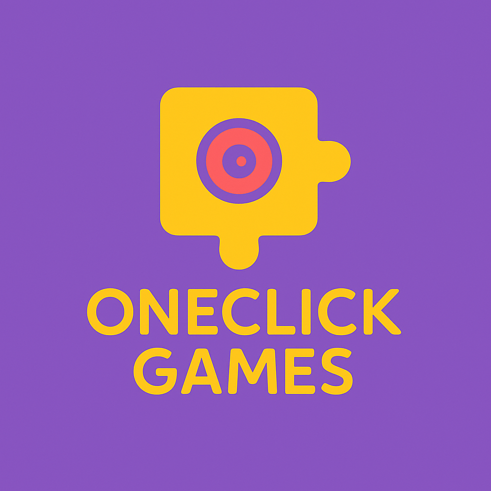

<p align="center">
  
</p>

<h1 align="center">🎮 OneClick Games</h1>
<p align="center">Plataforma web de juegos accesibles para personas con discapacidades físicas o cognitivas</p>

<p align="center">
  <strong>Proyecto Final de Ciclo DAW</strong> · Desarrollado por Andreu Orenga Ramón
</p>

---

## 📁 Descripción del Proyecto

**OneClick Games** es una plataforma web desarrollada con el objetivo de ofrecer juegos interactivos, inclusivos y accesibles, pensados especialmente para personas con dificultades motrices o cognitivas. La idea principal es que todo se pueda controlar con una sola mano, mediante interfaces simples, botones grandes y navegación por teclado.

## 🎯 Objetivos del Proyecto

- Crear una experiencia de juego inclusiva y divertida.
- Aplicar las pautas de accesibilidad (WCAG).
- Desarrollar juegos simples, responsive y jugables por teclado o clic.
- Implementar ranking y puntuaciones para fomentar la motivación.
- Panel de administración para gestionar contenidos.

---

## 🧠 Público Objetivo

- Personas con discapacidad física o cognitiva.
- Familias, cuidadores y profesionales del ámbito educativo.
- Entornos terapéuticos y de estimulación cognitiva.

---

## 💡 Tecnologías utilizadas

<p align="center">
  
  
  
  
  
  
  
  
  
</p>

### ⚙️ Stack Tecnológico

- **Frontend**: Vue.js 3 + Vite + Tailwind CSS
- **Backend**: Laravel 12 (API RESTful)
- **Base de datos**: MySQL (gestionada con phpMyAdmin)
- **Diseño**: Figma (UI) + Draw.io (diagramas)
- **Control de versiones**: Git + GitHub
- **Contenedores**: Dev Containers con Docker
- **Despliegue**: Vercel (Frontend) · Railway (Backend + DB)

---

## 📁 Estructura del Repositorio

```
oneclick-games/
├── [frontend_oc](./frontend_oc/)         # Proyecto Vue 3 + Tailwind CSS
├── [backend_oc](./backend_oc/)           # Proyecto Laravel 12
├── [docker](./docker/)                   # Archivos de configuración de contenedores
├── [docs](./docs/)                       # Documentación técnica y recursos
└── README.md
```

Puedes acceder directamente a los proyectos desde aquí:
- 👉 [Ir al frontend (Vue)](./frontend_oc/)
- 👉 [Ir al backend (Laravel)](./backend_oc/)

---
## ✅ Requisitos previos

Antes de comenzar, asegúrate de tener instalados los siguientes programas en tu sistema:

- [Docker](https://www.docker.com/products/docker-desktop/)
- [Visual Studio Code](https://code.visualstudio.com/)
- Extensión de VS Code: [Dev Containers](https://marketplace.visualstudio.com/items?itemName=ms-vscode-remote.remote-containers)
- Git (opcional, pero recomendado): [Git](https://git-scm.com/)

---

## 🚀 Instalación local (DevContainer)

1. Clona este repositorio:

```bash
git clone https://github.com/tu-usuario/oneclick-games.git
cd oneclick-games
code .
```

2. Abre el proyecto en **Visual Studio Code** usando DevContainer:

- Asegúrate de tener Docker y Dev Containers habilitados.
- Abre la carpeta del proyecto (`oneclick-games`) en VS Code.
- VS Code detectará automáticamente el entorno DevContainer y levantará el contenedor.
- Espera a que se instale el entorno completo (puede tardar un poco la primera vez).

3. Ejecuta el script de configuración:

```bash
./setup.sh
```

Este script:

- Actualiza el sistema operativo dentro del contenedor.
- Instala todas las dependencias de backend (Laravel) y frontend (Vue).
- Copia el archivo `.env` del backend, genera la clave de la aplicación y ejecuta las migraciones.
- Crea dos alias permanentes para levantar los servidores:
  - `run_back`: ejecuta el backend en [http://localhost:8000](http://localhost:8000)
  - `run_front`: ejecuta el frontend en [http://localhost:5173](http://localhost:5173)

⚠️ Si los comandos `run_back` o `run_front` no funcionan, ejecuta manualmente:

```bash
source ~/.bashrc
```

Esto cargará los alias en la terminal actual.

4. Utiliza los siguientes comandos para levantar los servidores:

```bash
run_back   # Levanta el backend Laravel en http://localhost:8000
run_front  # Levanta el frontend Vue en http://localhost:5173
```

5. Visualizar la base de datos:
   Puedes acceder a pgAdmin en [http://localhost:5050](http://localhost:5050) con las siguientes credenciales por defecto:

- **Usuario:** [admin@admin.com](mailto\:admin@admin.com)
- **Contraseña:** admin

Luego añade una nueva conexión manualmente con estos datos:

- **Host:** postgres
- **Puerto:** 5432
- **Usuario:** oneclick
- **Contraseña:** oneclick
- **Base de datos:** oneclick\_db

## 🤝 Contacto

**Andreu Orenga Ramón**  
📧 andreuorenga@gmial.com
🎓 2º DAW - Proyecto Fin de Ciclo

